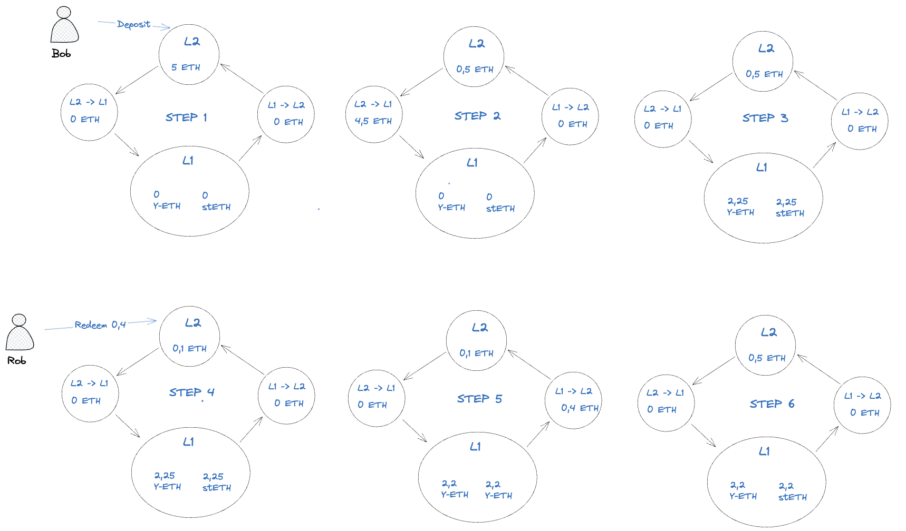

# Mirror 

## Context 

Joining, leaving, and re-balancing a L1 Pool is expensive, often prohibitively so but most of the DeFi ecosystem is on Ethereum with deep liquidity and more complex strategies. DeFi Pooling is a proposed solution to address the scalability issues in DeFi by bringing operations like depositing, withdrawing, and rebalancing onto Layer 2 (L2), making them more cost-effective and accessible to users. It leverages L2 UX technology and L1 more structured DeFi, promoting financial inclusion and open access.

The current solutions for DeFi pooling have demonstrated functionality, but they suffer from significant UX issues. Specifically, there is a lack of synchronization between the deposit and withdrawal processes. When users send ETH for pooling, they often experience long delays before receiving the corresponding tokens that in addition can not be used in DeFi for its illiquid aspect. 

It is crucial to carefully manage the flow of operations to optimize cost efficiency. Implementing a threshold-based approach or periodic handling for the L1-L2 bridge may not be the most efficient strategy. 

Relying on a fixed threshold or periodic schedule can for exemple result in suboptimal cost management, as it does not dynamically adapt to network conditions or user demand. It may lead to unnecessary bridge interactions and associated costs during periods of low activity or when the volume does not justify the expenses.

## Mirror Vaults

Introducing Mirror, L2 based Vaults that leverage L1 yields while providing instant deposit and redeem, dynamic capital rebalancing, and complete independence from governance.

#### Liquid token

By splitting the received capital into L2 and L1 and maintening an ideal allocation on both layer, we are able to guarentee liquidity for redeemers. 

Yield bearing tokens are issued when depositing, their price is can be obtained by dividing the total underlying holdings by the total supply. 

Total holdings = L2 underlying + L1 total yield tokens in underlying + Token waiting in the bridge ( - stream to participants )

While it is easy to obtain the l2 underlying balance, it can be harder to track L1 holdings. FIrst let's see the liquidity flow below

The Liquidity once bridge from L1 is invested in the yield startegies:
- step 2 : total holdings = 0,5 + 4,5 
- step 3 : total holdings = 0,5 + 2,25 Y-ETH * Y-ETH/ETH +2,25 stETH/ETH (Here we consider price is 1 for both pair)

The L2 vault after bridging ETH only know the step 2. 
When consuming L2 message on l1, the L1 vault directly withdraw ETH from Starkgate and allocate the capital in strategies which brings us to the step3. 

At this moment L2 needs to know: 
- 4,5 ETH Received (required so we know no more ETH in bridge)
- balance Y-ETH = 2,25 
- balance StEth = 2,25

A solution to get those 3 data would be to send back a "state change" message to L2 after all message consuming.

The problem is that price of the yields increases in permanance which results in increasing mirror token price so we need to update L2 contract the fastest possible to avoid a big jump of the share price that can be exploited by a user if he takes a flashloan, invest it all in the mirror vault, update the state and absorb 99,99% of the ETH generated. 

#### Data providers (Protocol participant)

Herodotus is a solution to proove current on-chain data between layers leveraging storage proof. With a call API, we can access our desired state update for a certain block. 

We need to proove the block where has been realised the step2 to step3 transition, to make it more decentralized and efficient we made the state update function permisionless, allowing anyone to particpate and earn a money stream.
If someone proove a state update on a younger block, he'll get rewarded. By creating MEV mechanism, we make sure our state is updated the fastest way possible, just after the message consuming from l1.

#### Liquidity allocation

The capital can be moved if the L2 or L1 allocation is too far from the ideal ratio. Everything is control from l2 sending messages to L1 contract for different task: withdrawBridge, depositBridge, rebalance. These actions are permisoonless and made possible under certain situation (too much liquidity on L2, not enough on L1), users handling functions get a money stream the same way as data prover (a total of underlying is allocated for participants and each task has its own weight).

The efficiency of the "copied" L1 strategy is related to the ETH L1 allocation as it is the only one to generate yields.
- When deposit volume increases from L2, the L1 allocation decreases leading in decreasing APY and as a consequence less deposit.
- When deposit volume decreases from L2, the L1 allocation increases leading in increasing APY and as a consequence more deposit.

Maintening an ideal L2 reserve can be very efficient in terms of gas because you can match depositors and redeemers while never acting on l1 (in ideal scenarios : yields increasing L1 reserve is compensated by increasing L2 reserve by bigger deposit demand -> No l1 gas fee to pay )

# Developer

Deployed Contracts: 
- https://goerli.etherscan.io/tx/0x6ebc4ee6228532dd691d3df99839d28eef331a9163ce3cf2b5e1e21e07bcf908
- https://goerli.etherscan.io/tx/0x6ebc4ee6228532dd691d3df99839d28eef331a9163ce3cf2b5e1e21e07bcf908

#### L2 contracts

The vault is using 4626 standard (the one realised by eni), supports cairo 0 tokens as underlying (so you can try it with eth goerli), interact with StarkGate, Herodotus Proof Registery, Pragma (yield balance to underlying) and Starknet Core for l1-l2 messaging. The contract is sending yield bearing token money streal to protocol participants for bridging and prooving l1 data. In this implementation 0.1% of tvl is sent every year, 70% for data provers and 30% for bridgers.  The l1-L2 messaging allow us to put all the callable functions on L2 so everything is managed from this contract to improve the participants UX .

Setup protostar https://docs.swmansion.com/protostar/docs/cairo-1/installation

Compile: head to contracts/l2contract and 'protostar build'

Declare: python3 contracts/l2contract/script/declare.py
Deploy: python3 contracts/l2contract/script/deploy.py
bridgeFromL2: python3 contracts/l2contract/script/bridgeFromL2.py

#### L1 contracts

yearn.vy: yearn v2 mock (the only yield).
L1Pooling.sol: Can consume message for:
- if the message of receiveETH is available on l1, the contract will withdraw eth from the bridge, wrap it and deposit it into the strategy
- if the message of bridgeETH is available on l1, the contract will redeem Y-ETH from the strategy, unwrap eth and send it to the L2 through starkgate

install hardhat 
https://hardhat.org/hardhat-runner/docs/getting-started#quick-start

Compile: npx hardhat compile
Deploy yearn vault mock : npx hardhat run deployVault
Deploy l1pooling : npx hardhat run deployPooling
handle receive from l2: handleConsumeReceive
handle bridge to l2: handleWithdraw

# Proof

Get value, L2 calldata and task id from herodotus (to prove l1 states for current block)

curl -X POST http://localhost:3000/api/herodotus 

Get Task status

curl -X GET "http://localhost:3000/api/herodotus?taskId=<53aafb2f-6901-40fd-a47e-add76f204683>"
replace with the desired taskId

#### Proof 

Access l1 contracts and scripts
The current version only integrates yearn as l1 strategy. 

https://goerli.etherscan.io/tx/0x6ebc4ee6228532dd691d3df99839d28eef331a9163ce3cf2b5e1e21e07bcf908
